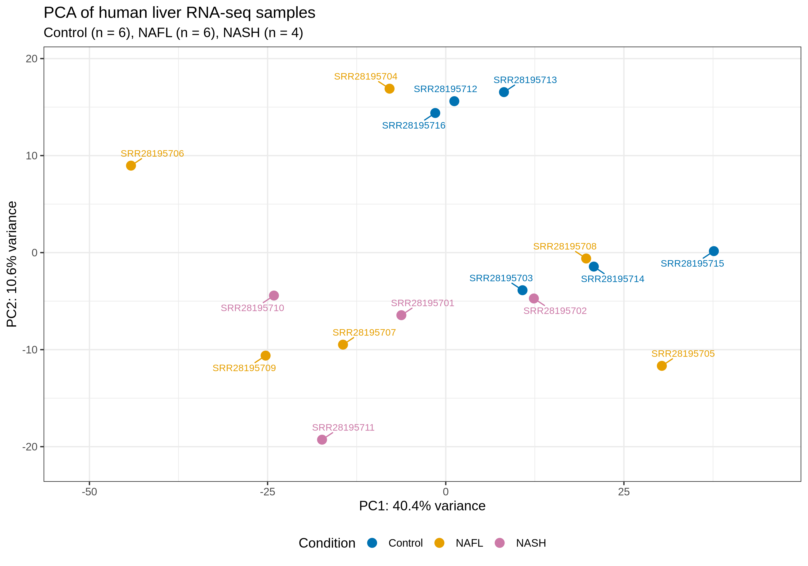
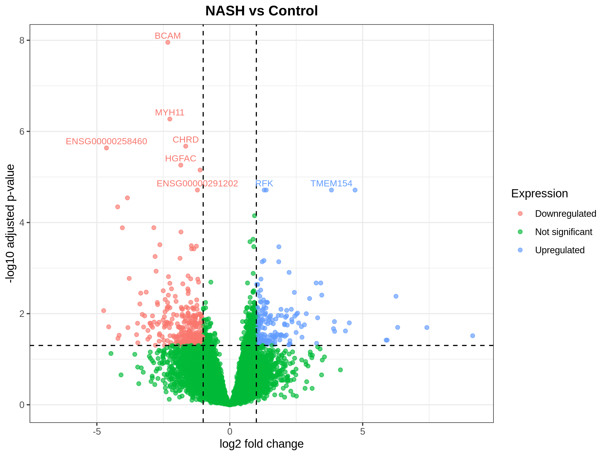
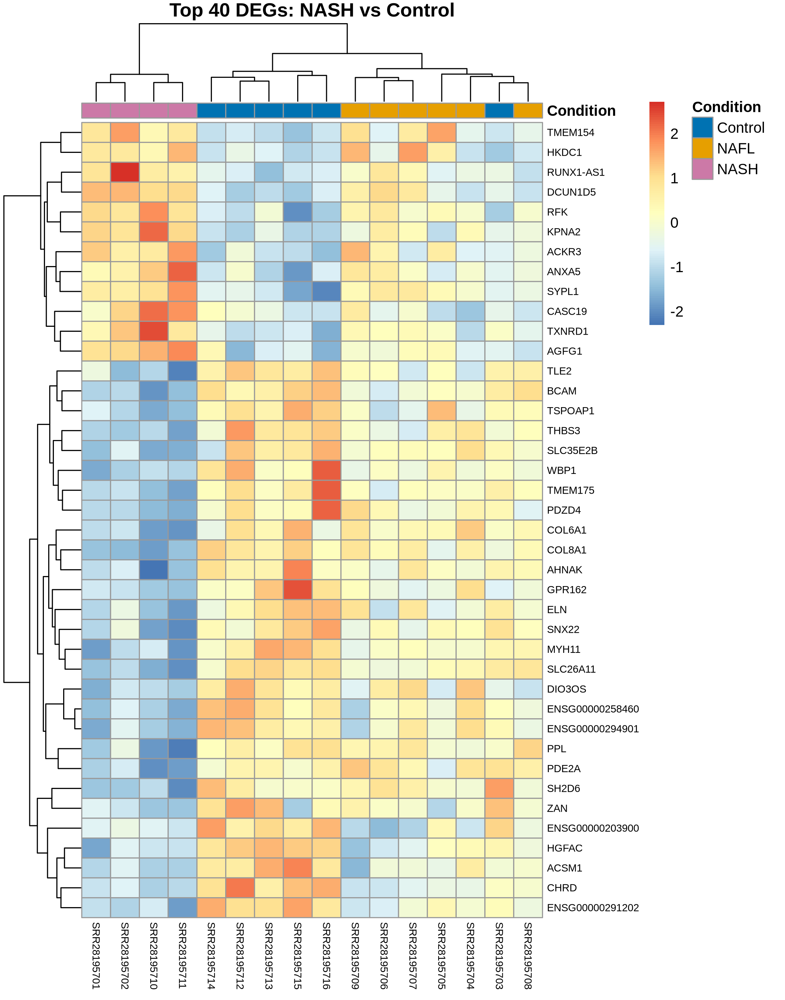

# Human Liver RNA-seq Analysis: Control, NAFL and NASH

A learning project investigating gene expression differences across **16 public human liver samples** from **GSE260666**: 6 Control, 6 NAFL and 4 NASH samples.

The workflow covers read quality control, STAR alignment, featureCounts quantification, DESeq2 differential expression analysis, and functional enrichment. It was run on my university’s HPC server.

**Main finding:** NASH versus Control showed the most differentially expressed genes: **474**, compared with **17** for NAFL versus Control and **28** for NASH versus NAFL, using adjusted p-value < 0.05 and absolute unshrunken log2 fold change ≥ 1.

These are exploratory findings from a small cohort. NASH versus NAFL results were particularly sensitive to fold-change shrinkage.

[Results](#key-results) · [Figures](#selected-figures) · [Run the analysis](#run-the-analysis) · [Detailed methods](ANALYSIS_NOTES.md) · [Validation](VALIDATION.md)

## Problem statement

**Which genes and biological processes differ between healthy Control, non-alcoholic fatty liver (NAFL), and non-alcoholic steatohepatitis (NASH) samples?**

This project compares the three groups to identify candidate genes and biological processes for further investigation. It combines individual-gene testing with gene-set analysis to examine expression patterns that may not be apparent from DEG counts alone.

Samples come from different individuals. The analysis measures associations with disease condition; it does not follow patients over time, demonstrate disease progression, establish causality, or provide a validated diagnostic test. NAFL and NASH terminology is retained from the supplied sample labels.

## My contribution

I completed this project to learn practical bulk RNA-seq analysis using public human liver data from GSE260666.

I wrote the analysis scripts and ran the workflow on my university’s high-performance computing (HPC) server. My work included:

- Downloading sequencing data and assessing read quality with FastQC and MultiQC.
- Aligning reads with STAR and generating gene counts with featureCounts.
- Performing differential expression analysis with DESeq2.
- Creating PCA plots, volcano plots, and heatmaps.
- Performing functional enrichment analysis and documenting the results.

This is an independent learning project based on previously published data. I did not generate the original sequencing data.

## Dataset

| Item | Description |
|---|---|
| Public source | [GEO GSE260666](https://www.ncbi.nlm.nih.gov/geo/query/acc.cgi?acc=GSE260666) |
| BioProject | PRJNA1082656 |
| Organism and tissue | Homo sapiens; liver |
| Groups | Control: 6; NAFL: 6; NASH: 4 |
| Sequencing | Illumina NovaSeq 6000; paired-end, 151 bp reads |
| Reference | GRCh38 primary assembly; GENCODE v48 |
| Included input | Gene-level raw count matrix and sample metadata |

Sample assignments are in [sample_metadata.tsv](metadata/sample_metadata.tsv). Run information is in [GSE260666_SraRunInfo.csv](metadata/GSE260666_SraRunInfo.csv).

## Workflow and analytical choices

| Stage | Tools or settings | Output |
|---|---|---|
| Download and QC | SRA Toolkit, FastQC, MultiQC | Paired FASTQs and quality report |
| Alignment | STAR; `--sjdbOverhang 150` | Alignments and mapping summaries |
| Quantification | featureCounts; paired fragments, `-s 2`, exon features, `gene_id` | Gene count matrix |
| Differential expression | DESeq2; `design = ~ condition` | Three pairwise comparisons |
| Visualization | VST, ggplot2, pheatmap | PCA, volcano plots and heatmaps |
| Enrichment | clusterProfiler, org.Hs.eg.db | GO Biological Process ORA and GSEA |
| Diagnostics | apeglm / ashr, marker expression, biotype composition | Effect-size sensitivity and exploratory checks |

The original workflow used raw reads without trimming, based on its reported QC assessment. Reverse-stranded counting follows the supplied STAR strandedness summary. Genes were retained when they had **at least 10 counts in at least 4 samples**, leaving **17,679 of 78,894 genes**.

Primary DEG lists use **BH-adjusted p-value < 0.05 and absolute unshrunken log2 fold-change ≥ 1**. This is an effect-size filter applied after testing, not a formal test against a two-fold-change null hypothesis. GSEA ranks genes by the DESeq2 Wald statistic. ORA uses the mapped retained-gene background rather than every gene in the genome.

Full parameter choices and interpretation are in [ANALYSIS_NOTES.md](ANALYSIS_NOTES.md).

## Analysis decisions and lessons learned

- **Read trimming:** The initial QC assessment supported proceeding without trimming. However, GC-content flags remain unresolved and are documented in [ANALYSIS_NOTES.md](ANALYSIS_NOTES.md).
- **Strandedness:** Reverse-stranded counting (`featureCounts -s 2`) was selected based on the STAR strandedness summary.
- **Sample variability:** PCA showed overlapping disease groups. This limits how confidently sample variation can be attributed to disease condition alone.
- **Effect-size sensitivity:** For NASH versus NAFL, applying the fold-change threshold to shrunken estimates reduced the selected gene count from 28 to 1, using the same original adjusted p-values. This highlights the sensitivity of the gene list to effect-size estimation.
- **Reproducibility:** The included count matrix supports a shorter rerun of the downstream analysis. The counts-based validation and remaining checks are documented in [VALIDATION.md](VALIDATION.md).

## Key results

| Comparison | DEGs | Upregulated | Downregulated | Passing with shrunken log2FC* |
|---|---:|---:|---:|---:|
| NAFL vs Control | 17 | 10 | 7 | 15 |
| NASH vs Control | 474 | 184 | 290 | 337 |
| NASH vs NAFL | 28 | 10 | 18 | 1 |

*Same original adjusted p-values, with the fold-change threshold applied to shrunken estimates. Up/down directions are relative to the first group named. Shrinkage uses apeglm for comparisons against Control and ashr for NASH vs NAFL; these are different estimators.*

- **Quality and quantification:** supplied STAR summaries show approximately 91–95% uniquely mapped reads. featureCounts assignment rates are 69.7–81.4%.
- **Gene-level differences:** NASH vs Control has the most DEGs. NASH vs NAFL is particularly sensitive to fold-change shrinkage, so its unshrunken DEG count needs cautious interpretation.
- **Functional themes:** saved enrichment results include RNA processing, ribosome biogenesis, metabolic processes, and immune-related processes. These are associations requiring further study.
- **GO-BP GSEA:** 307, 660 and 647 significant terms are reported for NAFL vs Control, NASH vs Control and NASH vs NAFL, respectively. GO terms overlap; these are not counts of independent pathways.
- **GSEA sensitivity analysis:** Excluding outlier-filtered genes retained 91.2–96.8% of the original significant terms, with no direction reversals among shared terms. Leading themes persisted, although individual term lists changed. Software and sampling differences may also contribute. See [validation details](VALIDATION.md).

## Selected figures

### Sample relationships



PCA provides an overview of sample variation. The groups do not separate cleanly; the plot alone cannot distinguish biological heterogeneity from technical or other sources of variation.

### NASH versus Control



The volcano plot displays unshrunken log2 fold changes and adjusted p-values. The primary thresholds yield 184 upregulated and 290 downregulated genes.



The heatmap uses gene-wise standardized VST expression for the top 40 DEGs. Because genes were selected using the group comparison, this is a descriptive view, not independent evidence of predictive performance.

Additional plots are available in [figures/](figures/). Download and open [the MultiQC report](qc/multiqc_report.html) locally for interactive QC inspection.

## Run the analysis

From the repository root, with Conda installed:

```bash
conda env create -f environment.yml
conda activate gse260666
Rscript scripts/install_R_packages.R
bash scripts/run_from_counts.sh
```

This route starts from the included count matrix and runs scripts 06–14. Script 06 regenerates the RDS objects used downstream; they are intentionally excluded from the repository. Reruns overwrite corresponding outputs, so use a separate checkout when comparing results.

See [SETUP.md](SETUP.md) for the complete raw-read workflow, reference preparation, HPC configuration and GitHub upload instructions. The counts-based rerun used R 4.4.3, Bioconductor 3.20 and ggplot2 3.5.2. The setup files incorporate the dependency fixes used for that run. The revised installation recipe has not independently been tested from scratch and is not an exact environment lockfile.

## Repository contents

| Location | Contents |
|---|---|
| [scripts/](scripts/) | Numbered analysis scripts, setup helpers and counts-only runner |
| [metadata/](metadata/) | Sample labels, SRA accessions, gene annotation and recorded software versions |
| [counts/](counts/) | Compressed raw gene counts and featureCounts summary |
| [qc/](qc/) | Saved MultiQC HTML report |
| [results/deseq2/](results/deseq2/) | Full and significant DE tables, annotated genes and normalized counts |
| [results/enrichment/](results/enrichment/) | GO-BP ORA and GSEA tables |
| [results/diagnostics/](results/diagnostics/) | Shrunken estimates, marker expression and biotype summaries |
| [results/final_tables/](results/final_tables/) | Concise enrichment summaries |
| [figures/](figures/) | Expression, enrichment and diagnostic plots |
| [ANALYSIS_NOTES.md](ANALYSIS_NOTES.md) | Detailed methods and interpretation |
| [VALIDATION.md](VALIDATION.md) | Checks performed and outstanding verification |

Raw FASTQs, BAMs, references, STAR indices, environments and generated RDS objects are excluded to keep the repository compact. Original software records are in [R_sessionInfo_final.txt](metadata/R_sessionInfo_final.txt) and [software_versions_initial.txt](metadata/software_versions_initial.txt).

## Skills demonstrated by the repository

- Linux/Bash workflow scripting and sequencing-data handling.
- Sample matching, count-matrix preparation and gene annotation.
- Statistical analysis in R using DESeq2 and multiple-testing adjustment.
- Expression visualization, functional enrichment and effect-size sensitivity analysis.
- Documentation of assumptions, outputs and reproducibility limits.

## Limitations and verification status

The cohort is small, especially NASH (n = 4), and the model includes condition only. Clinical covariates and fibrosis stage were not included. Bulk expression differences may reflect cell composition as well as changes within cells. No independent cohort validation was performed.

The counts-based workflow was rerun on 27 September 2026 after resolving environment dependencies. All six DESeq2 result tables and six enrichment tables matched the original outputs within a numerical tolerance of `1e-8`.

This validation started from the included count matrix. It did not repeat the original raw-read downloading, quality control, alignment, or counting steps. The revised installation instructions have not yet been independently tested from scratch.

Remaining checks include reviewing runtime warnings and unresolved GC-content flags, independently confirming sample labels against GEO, and validating the raw-read workflow. Evaluation in an independent cohort would be needed to assess whether the findings generalize.

See [VALIDATION.md](VALIDATION.md) for the validation records, comparison methods, and remaining limitations.

## Data and methods references

- [Original dataset: GEO GSE260666](https://www.ncbi.nlm.nih.gov/geo/query/acc.cgi?acc=GSE260666). This repository contains a secondary analysis of public data.
- [GENCODE human release 48](https://www.gencodegenes.org/human/release_48.html).
- [DESeq2](https://bioconductor.org/packages/DESeq2/) and [clusterProfiler](https://bioconductor.org/packages/clusterProfiler/) documentation.

Public data and third-party software retain their respective usage terms. No license for the repository author's code has been selected in this package.

## Author

**Nandkishor Virani**

Developed this project to gain practical experience in bulk RNA-seq analysis using a university HPC server.

- [GitHub](https://github.com/Nandkishor-30)
- [LinkedIn](https://www.linkedin.com/in/nandkishor-virani-5910751a0/)
